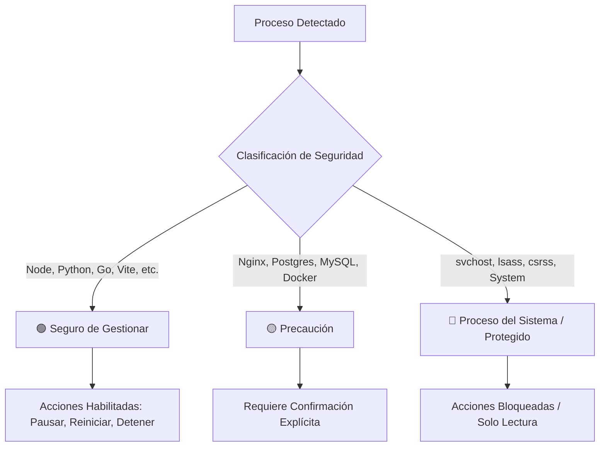

# Política de Seguridad y Clasificación de Procesos — LocalPort Manager

## 1. Principio de Menor Privilegio (Least Privilege)
**LocalPort Manager** está diseñado para ejecutarse como un proceso de usuario estándar sin necesidad de privilegios elevados (Administrador) para su operación normal de desarrollo.
- Los desarrolladores ejecutan sus servidores locales (Node.js, Vite, Python, etc.) bajo su propia cuenta de usuario.
- Por tanto, la aplicación puede inspeccionar, pausar (`NtSuspendProcess`), reanudar (`NtResumeProcess`) y terminar (`taskkill`) estos procesos de forma nativa sin requerir elevación UAC.
- Si un puerto pertenece a un servicio del sistema o de otro usuario donde no se cuenta con permisos suficientes, la aplicación capturará el código de error `Access Denied` y lo mostrará con claridad sin congelarse ni fallar.

---

## 2. Clasificación de Seguridad de Procesos

Para evitar la interrupción accidental de componentes críticos del sistema operativo, todo proceso detectado se clasifica automáticamente en tres categorías de seguridad:

### 2.1. 🟢 Seguro de Gestionar (Safe)
Procesos típicos de desarrollo local iniciados por el usuario:
- Entornos de ejecución: `node.exe`, `python.exe`, `pythonw.exe`, `deno.exe`, `bun.exe`, `ruby.exe`, `php.exe`, `go.exe`, `cargo.exe`.
- Herramientas de empaquetado: `npm.cmd`, `pnpm.cmd`, `yarn.cmd`, `npx.cmd`.
- Gestores de desarrollo: `vite`, `next`, `astro`, `uvicorn`, `gunicorn`, `flask`.
- **Comportamiento**: Todas las acciones (Pausar, Reanudar, Reiniciar, Detener) están habilitadas. Se solicita confirmación simple antes de terminar.

### 2.2. 🟡 Precaución (Caution)
Servicios de infraestructura local y servidores web que pueden contener estado o datos persistentes:
- Bases de datos: `postgres.exe`, `mysqld.exe`, `redis-server.exe`, `mongod.exe`.
- Servidores web: `nginx.exe`, `httpd.exe`, `caddy.exe`.
- Plataformas de contenedores: `com.docker.backend.exe`, `wsl.exe`.
- **Comportamiento**: La tarjeta muestra una insignia de precaución. Al intentar detener el proceso, el diálogo de confirmación resalta que se trata de un servicio de infraestructura compartida.

### 2.3. 🔴 Proceso Crítico del Sistema (System / Protected)
Componentes esenciales del núcleo de Windows y servicios de seguridad:
- Lista negra estricta de PIDs: PID `0` (Idle), PID `4` (System).
- Lista negra de ejecutables del sistema:
  `svchost.exe`, `csrss.exe`, `lsass.exe`, `services.exe`, `smss.exe`, `wininit.exe`, `winlogon.exe`, `explorer.exe`, `spoolsv.exe`, `conhost.exe`, `dwm.exe`.
- **Comportamiento**: **Bloqueo total de acciones destructivas**. Los botones de [Pausar], [Reiniciar] y [Detener] se deshabilitan por completo. La interfaz muestra la etiqueta `● SISTEMA PROTEGIDO`.

---

## 3. Seguridad en la Terminación de Procesos
- **Terminación Limpia (Graceful)**:
  La primera opción de apagado utiliza `taskkill /PID <PID> /T` sin el flag forzado `/F`, enviando una señal de cierre limpia (`WM_CLOSE` / evento de consola) para permitir que el servidor guarde estado y cierre sockets.
- **Terminación Forzada (Force Kill)**:
  Únicamente si el proceso no responde tras una solicitud de parada y el usuario confirma explícitamente "Forzar detención", se ejecuta `taskkill /F /T /PID <PID>`.
- **Gestión del Árbol de Procesos**:
  El parámetro `/T` asegura que los subprocesos hijos (por ejemplo, los procesos `esbuild` o `node` generados por Vite o npm) se cierren de forma sincronizada, impidiendo que queden puertos "zombies" u ocupados tras el cierre.

---

## 4. Privacidad y Seguridad Local Absoluta (Zero-Telemetry)
- **100% Offline**: La aplicación no incluye ningún tipo de telemetría remota, analíticas en la nube ni envío de información a servidores externos.
- **Datos Sensibles Protegidos**: Los nombres de proyectos, comandos de terminal y rutas en disco permanecen exclusivamente en el equipo del usuario en `%APPDATA%/LocalPortManager/`.
- **IPC Seguro y Sanitizado**:
  - `nodeIntegration: false`, `contextIsolation: true`, `sandbox: true` en la capa de Electron.
  - Toda llamada IPC valida estrictamente los argumentos (por ejemplo, validando que los PIDs sean enteros numéricos positivos y sanitizando cadenas para evitar inyecciones de comandos en Windows).
